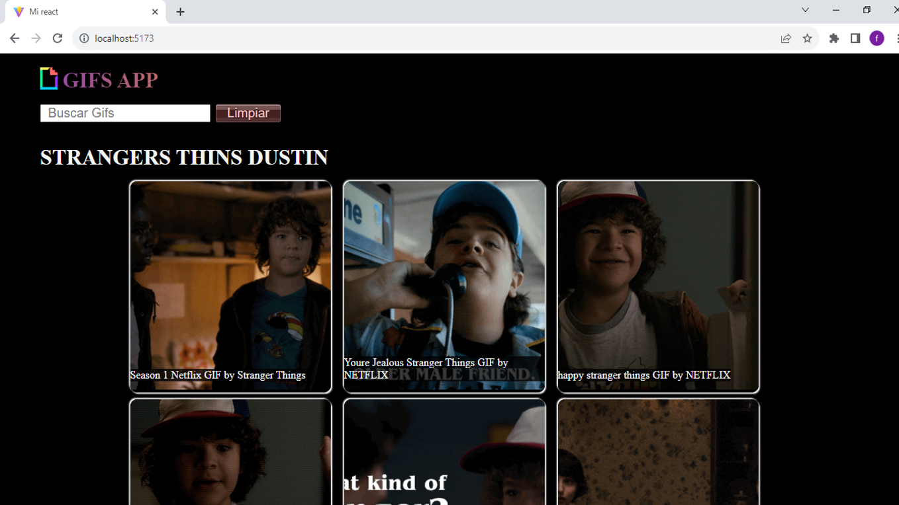

# Mi Primer Proyecto de React - Buscador de Imágenes en Giphy

¡Bienvenidos a mi primer proyecto de React! Este proyecto fue creado como parte de mi experiencia en Rolling Code School Comisión 49 I. Se trata de una aplicación web que te permite buscar y explorar imágenes divertidas en Giphy.

## Características

- Búsqueda de imágenes: Ingresa palabras clave en el cuadro de búsqueda para encontrar imágenes relacionadas en Giphy.
- Exploración de imágenes: Se limito la busqueda a 12 imagenes.
- Interfaz intuitiva: La aplicación tiene una interfaz sencilla y fácil de usar, perfecta para usuarios de todas las edades.
- Proyecto de React: Este proyecto fue desarrollado utilizando la biblioteca de JavaScript React, lo que permite una experiencia de usuario fluida y dinámica.

## Condicion de busqueda

- El formulario no se puede enviar vacio
- no puede haber carcteres vacio al inicio ni al final del string

## Capturas de Pantalla

_Imagen: Búsqueda de "gatos"._

_Imagen: Exploración de imágenes divertidas._

## Cómo Usar

1. Clona este repositorio a tu máquina local.
2. Abre una terminal y navega hasta el directorio del proyecto.
3. Ejecuta `npm install` para instalar las dependencias.
4. Ejecuta `npm start` para iniciar la aplicación en tu navegador.
5. Ingresa palabras clave en el cuadro de búsqueda para buscar imágenes.
6. Explora y disfruta de las imágenes que encuentres.

## Agradecimientos

Agradezco a Martin Jerez y a Conti luna por acompañarme tan bien en este lindo camino.

¡Espero que disfrutes explorando imágenes en Giphy con esta aplicación de React! ¡Tanto como yo haciendola!
